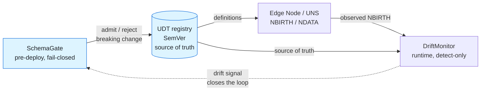
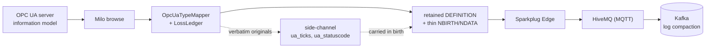

# sparkplug-governance-lab

[](https://github.com/LivingLikeKrillin/sparkplug-governance-lab/actions/workflows/governance-ci.yml)
[](LICENSE)


**Sparkplug B 및 통합 네임스페이스(Unified Namespace, UNS) 거버넌스**를 실증하기 위한 엔지니어링 랩(Lab)입니다. **Eclipse Tahu 1.0.14 + Eclipse Paho + HiveMQ CE** 기반 원시 프리미티브로부터 Sparkplug 세션의 양단(엣지 노드 및 호스트 애플리케이션)을 직접 구현하였으며, 스키마 진화, 제어 명령 인가, 지연 접속 시 상태 동기화(State-on-Connect), OT→IT 데이터 브리징 등 산업 현장의 핵심 거버넌스 난제를 분석하고 이를 **동작 가능한 코드로 강제(Enforce)**합니다.

**현황 및 상태:** 개인 개념 실증(PoC) 랩. 단일 브로커, 단일 노드 규모, JSON 파일 기반 레지스트리(Avro/Confluent 미사용). 본 프로젝트는 기술적 한계를 투명하게 공개합니다. 각 모듈의 아키텍처 결정 레코드(ADR)에는 명시적인 '한계 및 제약 사항' 섹션이 포함되어 있으며, 매핑 간 손실 정보는 은폐되지 않고 1급 결과물(손실 원장)로 표면화됩니다.

> ⚠️ `spb40` 모듈은 Sparkplug 3.0 프리미티브(Template/PropertySet)를 기반으로 Sparkplug 4.0 논의 주제([eclipse-sparkplug/sparkplug#608](https://github.com/eclipse-sparkplug/sparkplug/issues/608), [#607](https://github.com/eclipse-sparkplug/sparkplug/issues/607), [#603](https://github.com/eclipse-sparkplug/sparkplug/issues/603))에 대한 **개념적 프로토타입**을 실증합니다. Sparkplug 4.0은 공식 릴리스 전이며 와이어 포맷이 확정되지 않았으므로, 공식 사양 구현체가 아닙니다.

## 핵심 개념 (The one-line idea)

배포 전 검증 게이트가 거버넌스 루프를 열고, 런타임 드리프트 감지가 이를 닫아 완성합니다.

<!-- mirror of docs/diagrams/src/governance-lifecycle.mmd — keep in sync (see docs/diagrams/README.md) -->


## 시스템 아키텍처 (Architecture)


## 모듈 구성 (Modules)

순수 로직 모듈 전체는 TDD(테스트 주도 개발)로 작성되었습니다 (99개 단위 테스트, `mvn test` 실행, 외부 브로커 불필요). MQTT/Kafka/OPC UA 외곽 쉘은 실제 서비스를 대상으로 한 라이브 데모를 통해 검증됩니다.

| 모듈 | 역할 및 수행 작업 | 연계 ADR |
|------|-------------------|----------|
| `schema` | **데이터 계약 레지스트리.** 파일 시스템 기반 UDT 스키마 레지스트리로 SemVer 규격 정의와 호환성 어휘(`CompatMode` FORWARD/BACKWARD/FULL/NONE, `Verdict`, `Violation`)를 제공합니다. **폐쇄형 실패 게이트 자체(`SchemaGate`, `CompatibilityChecker`)는 커밋 `0b9b1ae`에서 [bifrost](https://github.com/yggdrasil-iiot/bifrost)로 이관되어 본 저장소에서는 제외되었습니다.** | [0007](docs/adr/ADR-0007-schema-registry-gate.md) |
| `spb40` | **스키마-데이터 분리 프로토타입** (#608 개념 실증): 완전한 UDT 정의는 영속(Retained) `DEFINITION` 토픽에 1회만 발행하고, 텔레메트리 데이터는 경량 `schemaRef`와 Alias 전용 메트릭만 운반합니다. 멤버 단위 `engUnit`(#607) 및 메트릭별 `quality`(#603) 속성을 PropertySet으로 구성합니다. 실측 NBIRTH 페이로드: **인라인 방식 328 B vs 경량 분리 방식 162 B (약 50% 절감)**. 소비자 측 스키마 학습은 멱등성을 보장합니다(영속 및 라이브 중복 수신 처리, 동일 ref에 대한 스키마 재정의 시 불변성 위반 감지). | [0008](docs/adr/ADR-0008-schema-data-separation.md) |
| `kafka` | **상태 기반 UNS→Kafka 브리지.** NBIRTH 상태로부터 Alias→Name 매핑을 복원하고, 최신 관측값(LKV)을 누적하며, ISA-95 경로를 Kafka 토픽으로 변환합니다. 핵심 통찰: Sparkplug RBE의 최신값 유지는 Kafka의 **로그 압축(Log Compaction)**과 동형(Isomorphic) 관계를 형성합니다(Key = 메트릭 고유 식별자). 계약 위반 레코드는 메인 토픽 오염을 방지하기 위해 Dead Letter Queue(DLQ)로 격리 라우팅됩니다. | [0009](docs/adr/ADR-0009-uns-to-kafka-stateful-bridge.md) |
| `opcua` | **OPC UA 정보 모델 → Sparkplug UDT 매핑.** Eclipse Milo 탐색(browse) 기반: 서브타입 상속 및 `HasInterface` 다중 상속을 출처 레이블과 함께 단일 계층으로 평탄화(Flattening)하며, 명시적 **손실 원장(Loss Ledger)**을 제공합니다 (본 매핑은 DateTime 정밀도, StatusCode 비트 폭, 타입 식별자 등에서 무손실이 아니며, 사이드 채널 프로퍼티인 `ua_ticks`, `ua_statuscode`를 통해 원본 데이터를 손실 없이 온전히 보존합니다). | [0010](docs/adr/ADR-0010-opcua-udt-mapping.md) |
| `acl` *(이관됨)* | **NCMD 제어 명령 인가** ([eclipse-sparkplug/sparkplug#600](https://github.com/eclipse-sparkplug/sparkplug/issues/600) 연계). 핵심 관찰: NCMD 토픽 자체에는 구체적 명령명이 포함되지 않으며 실제 명령 식별자는 페이로드 메트릭 내부에 존재합니다. 따라서 브로커 토픽 ACL은 *노드 단위 도달 가능성*만 강제할 수 있으며, 명령별·값별 심층 인가는 페이로드 가시성을 확보한 엣지에서 수행되어야 합니다. 단일 기본 거부(Deny-by-Default) 정책 파일로부터 엣지 인가자(폐쇄형 실패), 브로커 ACL 아티팩트, CI 린트 게이트가 파생됩니다. 또한 요청 단독 인가자로 표현 불가능한 컨텍스트 조건부 판정을 위해 **JVM 내장 OPA/Rego 정책 평가(Chicory 기반 WebAssembly)**를 지원하며, 저장소에 커밋된 wasm과의 CI 드리프트 방지 가드가 포함됩니다. **커밋 `0b9b1ae`에서 [bifrost](https://github.com/yggdrasil-iiot/bifrost)로 이관되어 본 저장소에는 `acl/` 코드가 더 이상 포함되지 않습니다.** | [0011](docs/adr/ADR-0011-command-authorization.md) |
| `drift` | **런타임 스키마 드리프트 감지** (수동 관측 전용): 관측된 NBIRTH UDT 정의를 레지스트리의 정본(Source of Truth)과 수동 비교하여(UNREGISTERED / VERSION_DRIFT / 멤버 불일치), 노후화 상태를 추적하고 거버넌스 건전성 메트릭을 발행합니다. 이를 통해 배포 전 사전 게이트(`schema`)가 연 거버넌스 루프를 사후 런타임에서 완결합니다. | [0012](docs/adr/ADR-0012-runtime-drift-detection.md) |

프로토콜 기본 특성을 규명하기 위해 선행 구현된 세션 프리미티브 데모: Birth/Death 라이프사이클 + bdSeq/seq 시퀀스 + Rebirth 재생성(`SessionDemo`), 기본 호스트 기반 저장 후 전달(`StateStoreForwardDemo`), Sparkplug 인식 브로커 기반 지연 참여자(Late-Joiner) A/B 비교(`LateJoinerExperiment`), UDT 무단 덮어쓰기 감지 결함(`UdtDemo`), Protobuf→JSON 상태 변환 브리지(`JsonBridgeDemo`), 세션 탈취 폭풍 실증(`StolenSessionDemo`).

### OT→IT 데이터 흐름 (OT→IT Data Flow)

<!-- mirror of docs/diagrams/src/ot-it-dataflow.mmd — keep in sync (see docs/diagrams/README.md) -->


## 포트폴리오 연계 — 인가된 제어 명령 경로 (Bifrost 이관)

> [!NOTE]
> 본 랩은 원래 인가된 제어 명령 경로의 전체 라이브 파이프라인을 포함하고 있었습니다. `bridge` 패키지의 `NcmdOpcUaBridge`가 `spBv1.0/{group}/NCMD/{edge}`를 구독하고, `acl` 모듈을 통해 엣지에서 기본 거부(Deny-by-Default) 방식으로 각 명령을 재인가한 후, OPC UA에 제어를 적용(Write + Read 확인)하였습니다.
> "명령별·값별 인가는 브로커 토픽이 아닌 페이로드 가시성이 확보된 엣지에서 직접 수행되어야 한다"는 핵심 설계 원칙은 [bifrost](https://github.com/yggdrasil-iiot/bifrost)의 런타임 제어 경계 데몬(Heimdall)으로 발전하여 이관되었습니다.
>
> 커밋 `0b9b1ae` (2026-07-08)를 통해 `acl/` 및 `bridge/`는 본 저장소에서 분리 이관되었습니다. 과거 연계 파이프라인의 상위 발신자였던 koshei 컴포넌트는 폐기되었습니다. 상세한 이력은 `git log`, [ADR-0011](docs/adr/ADR-0011-command-authorization.md), 그리고 bifrost 저장소를 참조하십시오.

## 빌드 및 실행 가이드 (Running)

요구 사항: Java 17+, Maven 3.9+, Docker.

```bash
docker compose up -d        # HiveMQ CE (:1883, 로컬 개발용 allow-all) + Kafka KRaft (:9092)
mvn test                    # 99개 순수 로직 단위 테스트 실행 (외부 브로커 불필요)
```

데모 실행 (저장소 루트에서 실행하십시오 — 파일 레지스트리는 현재 작업 디렉토리 기준 상대 경로로 참조됩니다):

```bash
mvn -q exec:java -Dexec.mainClass=dev.krillin.sparkplug.SessionDemo        # Sparkplug 세션 End-to-End 동작
mvn -q exec:java -Dexec.mainClass=dev.krillin.sparkplug.Spb40Demo          # #608/#607/#603 프로토타입 실증
mvn -q exec:java -Dexec.mainClass=dev.krillin.sparkplug.UnsToKafkaDemo     # 상태 기반 UNS→Kafka 브리지
mvn -q exec:java -Dexec.mainClass=dev.krillin.sparkplug.DriftMonitorDemo   # 런타임 스키마 드리프트 감지
```

OPC UA 브리지 데모(`OpcUaUdtBridgeDemo`)는 시뮬레이션 서버가 추가로 필요합니다: `python opcua-sim-server.py` (`pip install asyncua` 필요).

Sparkplug 인식(aware) 모드에서 지연 참여자(Late-Joiner) A/B 실험을 수행하려면, [hivemq-sparkplug-aware-extension](https://github.com/hivemq/hivemq-sparkplug-aware-extension)을 `hivemq-extensions/` 디렉토리에 배치하고([hivemq-extensions/README.md](hivemq-extensions/README.md) 참조), `docker compose -f docker-compose.yml -f docker-compose.aware.yml up -d --force-recreate` 명령으로 기동하십시오.

## 문서 체계 (Documentation)

- [`docs/glossary.md`](docs/glossary.md) — 표준 기술 용어 사전 (도메인 개념, 데이터 계약, 상태 머신, 통신 프로토콜, 거버넌스 원칙)
- [`docs/adr/`](docs/adr/README.md) — 11편의 아키텍처 결정 레코드 (ADR, 한국어 정본 및 영어 번역본 제공)
- [`docs/namespace-standard.md`](docs/namespace-standard.md) — UNS 네임스페이스 거버넌스 표준 v0.1 (ISA-95→토픽 인코딩, 식별자 고유성, 데이터 계약, UDT 버전 관리, Alias 레지스트리, 제어 명령 ACL, STATE/저장 후 전달 역할, 관측 가능성) — [영어 번역본](docs/namespace-standard.en.md)

## 엔지니어링 투명성 선언 (Honesty Notes)

- 개인 실증(PoC) 규모: 단일 노드 브로커, JSON 파일 기반 레지스트리, At-Least-Once Kafka 전송, 시퀀스 재정렬 미지원.
- OPC UA→UDT 매핑은 **무손실(Lossless)이 아니며**, 이를 숨기지 않습니다 — 손실 항목은 멤버 단위 손실 원장(Loss Ledger)에 기록되며, 정밀도가 요구되는 원본 데이터는 사이드 채널 프로퍼티를 통해 원형 그대로 보존됩니다.
- 본 랩의 일부 구현 및 문서는 AI 지원을 받아 작성되었으나, 모든 아키텍처 설계, 수치 측정, 데모 결과는 실제 구동 중인 브로커 및 서비스를 대상으로 작성자가 직접 검증을 완료하였습니다.

## 라이선스 (License)

[Apache-2.0](LICENSE)
