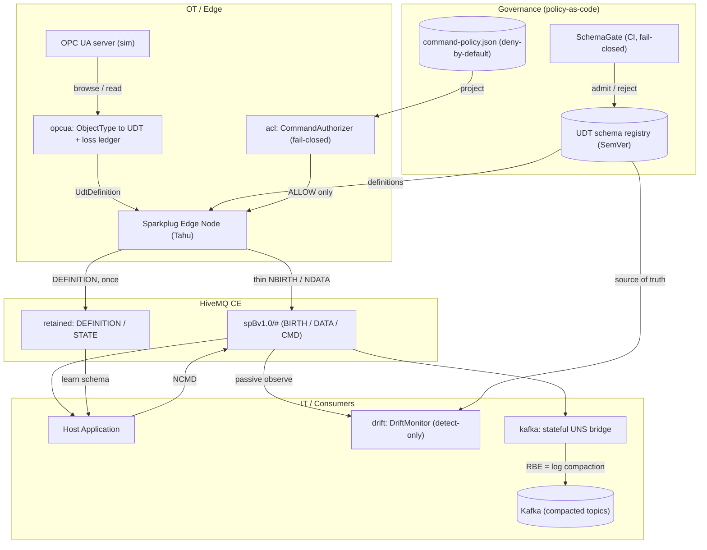

# sparkplug-governance-lab

A hands-on lab for **Sparkplug B / Unified Namespace (UNS) governance**: both ends of a Sparkplug session (Edge Node + Host Application) implemented from primitives on **Eclipse Tahu 1.0.14 + Eclipse Paho + HiveMQ CE**, then used to characterize real governance problems — schema evolution, command authorization, state-on-connect, OT→IT bridging — and to **enforce** answers to them as working code.

**Status:** personal proof-of-concept lab. Single broker, single node scale, JSON file registry (not Avro/Confluent). It is honest about its limits — every module's ADR has an explicit "limitations" section, and lossy mappings are surfaced as first-class outputs rather than hidden.

> ⚠️ The `spb40` module prototypes **concepts under discussion** for Sparkplug 4.0
> ([eclipse-sparkplug/sparkplug#608](https://github.com/eclipse-sparkplug/sparkplug/issues/608),
> [#607](https://github.com/eclipse-sparkplug/sparkplug/issues/607),
> [#603](https://github.com/eclipse-sparkplug/sparkplug/issues/603)) on top of Sparkplug 3.0
> primitives (Template/PropertySet). Sparkplug 4.0 is unreleased and its wire format is not
> final — this is *not* a spec implementation.

## Architecture



## Modules

All pure-logic modules are TDD'd (142 tests, `mvn test`, no broker needed); MQTT/Kafka/OPC UA shells are exercised by live demos against real services.

| Module | What it does | ADR |
|--------|--------------|-----|
| `schema` | **Data-contract registry + compatibility gate.** Disk-backed UDT schema registry with SemVer'd definitions and a fail-closed CLI gate (`SchemaGate`) that rejects breaking changes pre-deployment (FORWARD/BACKWARD/FULL/NONE, Confluent vocabulary). | [0007](docs/adr/ADR-0007-schema-registry-gate.en.md) |
| `spb40` | **Schema↔data separation prototype** (#608 concept): full UDT definition published once to a retained `DEFINITION` topic; data carries a thin `schemaRef` + alias-only metrics. Member `engUnit` (#607) and per-metric `quality` (#603) as PropertySets. Measured NBIRTH: **328 B inline vs 162 B thin**. Consumer-side learning is idempotent (retained + live duplicate delivery handled; same-ref redefinition flagged as an immutability violation). | [0008](docs/adr/ADR-0008-schema-data-separation.en.md) |
| `kafka` | **Stateful UNS→Kafka bridge.** Restores alias→name from NBIRTH state, accumulates last-known values, maps ISA-95 paths to Kafka topics. Key insight: Sparkplug RBE last-known-value is isomorphic to Kafka **log compaction** (key = metric identity). Contract violations route to a DLQ instead of polluting the main topic. | [0009](docs/adr/ADR-0009-uns-to-kafka-stateful-bridge.en.md) |
| `opcua` | **OPC UA information model → Sparkplug UDT mapping** via Eclipse Milo browse: subtype inheritance + `HasInterface` multiple-inheritance flattening with provenance labels, and an explicit **loss ledger** (the mapping is *not* lossless — DateTime precision, StatusCode width, type identity) with side-channel properties (`ua_ticks`, `ua_statuscode`) preserving the originals verbatim. | [0010](docs/adr/ADR-0010-opcua-udt-mapping.en.md) |
| `acl` | **NCMD command authorization** (relates to [eclipse-sparkplug/sparkplug#600](https://github.com/eclipse-sparkplug/sparkplug/issues/600)). Key observation: the NCMD topic carries no command name — command identity lives in the payload metric, so broker topic ACLs can only enforce *node-level reachability*; per-command / per-value authorization needs payload visibility. One deny-by-default policy file projects to an edge-side authorizer (fail-closed), a broker ACL artifact, and a CI lint gate. | [0011](docs/adr/ADR-0011-command-authorization.en.md) |
| `drift` | **Runtime schema-drift detection** (detect-only): passively compares observed NBIRTH UDT definitions against the registry's source of truth (UNREGISTERED / VERSION_DRIFT / member drift), tracks staleness, and emits governance health metrics — closing the loop that the pre-deployment gate (`schema`) opens. | [0012](docs/adr/ADR-0012-runtime-drift-detection.en.md) |

Plus session-fundamentals demos built first to characterize the protocol: birth/death + bdSeq/seq + rebirth (`SessionDemo`), primary-host store-and-forward (`StateStoreForwardDemo`), late-joiner A/B with a Sparkplug-aware broker (`LateJoinerExperiment`), UDT silent-replacement gap (`UdtDemo`), protobuf→JSON bridge (`JsonBridgeDemo`), stolen-session storms (`StolenSessionDemo`).

## Running

Requirements: Java 17+, Maven 3.9+, Docker.

```bash
docker compose up -d        # HiveMQ CE on :1883 (allow-all, local dev) + Kafka KRaft on :9092
mvn test                    # 142 pure-logic tests, no broker needed
```

Demos (run from the repo root — the file registry is resolved relative to the working directory):

```bash
mvn -q exec:java -Dexec.mainClass=dev.krillin.sparkplug.SessionDemo        # Sparkplug session end-to-end
mvn -q exec:java -Dexec.mainClass=dev.krillin.sparkplug.SchemaGateDemo     # registry + compat gate (no broker)
mvn -q exec:java -Dexec.mainClass=dev.krillin.sparkplug.Spb40Demo          # #608/#607/#603 prototype
mvn -q exec:java -Dexec.mainClass=dev.krillin.sparkplug.UnsToKafkaDemo     # stateful UNS→Kafka bridge
mvn -q exec:java -Dexec.mainClass=dev.krillin.sparkplug.CommandAclDemo     # NCMD authorization (incl. the case a broker ACL cannot block)
mvn -q exec:java -Dexec.mainClass=dev.krillin.sparkplug.DriftMonitorDemo   # runtime drift detection
```

The OPC UA bridge demo (`OpcUaUdtBridgeDemo`) additionally needs the simulated server: `python opcua-sim-server.py` (requires `pip install asyncua`).

For the late-joiner A/B experiment in *aware* mode, drop the [hivemq-sparkplug-aware-extension](https://github.com/hivemq/hivemq-sparkplug-aware-extension) into `hivemq-extensions/` (see [hivemq-extensions/README.md](hivemq-extensions/README.md)) and start with `docker compose -f docker-compose.yml -f docker-compose.aware.yml up -d --force-recreate`.

## Documentation

- [`docs/adr/`](docs/adr/README.md) — 11 architecture decision records, **bilingual** (Korean originals + English translations)
- [`docs/namespace-standard.md`](docs/namespace-standard.md) — UNS namespace governance standard v0.1 (ISA-95→topic encoding, identifier uniqueness, data contracts, UDT versioning, alias registry, command ACL, STATE/store-and-forward roles, observability) *(Korean)*

## Honesty notes

- Personal PoC scale: single-node brokers, JSON file registry, at-least-once Kafka delivery, no seq-reordering.
- The OPC UA→UDT mapping is **not lossless** and never claims to be — losses are enumerated per-member in a ledger, with verbatim side-channel preservation where fidelity matters.
- Parts of this lab were developed with AI assistance; all designs, measurements, and demo results were verified against live brokers/services by the author.

## License

[Apache-2.0](LICENSE)
