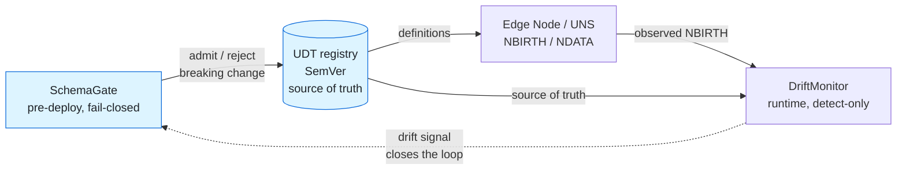
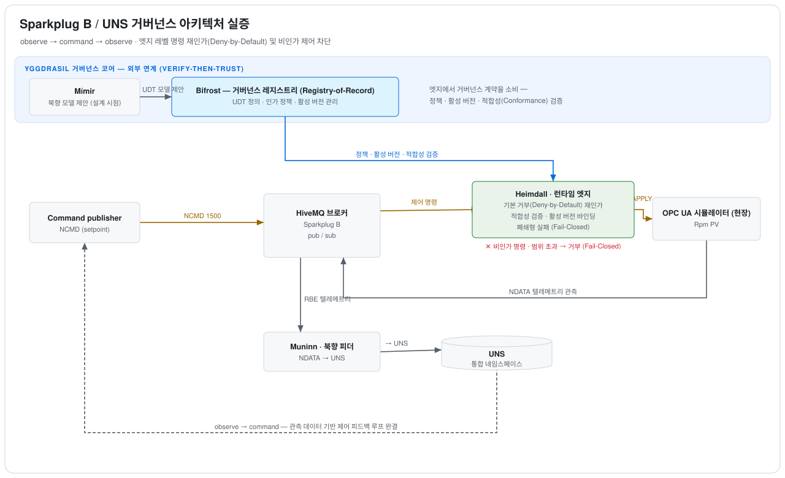
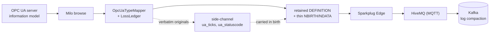

# sparkplug-governance-lab

[](https://github.com/LivingLikeKrillin/sparkplug-governance-lab/actions/workflows/governance-ci.yml)
[](LICENSE)


산업 IoT(IIoT) 및 스마트 제조 환경에서 **Sparkplug B 프로토콜과 통합 네임스페이스(Unified Namespace, UNS)**를 연계할 때 발생하는 아키텍처 거버넌스 공백을 규명하고, 이를 코드로 강제(Enforce)하기 위해 구축된 **실증 엔지니어링 랩(Reference Architecture Lab)**입니다.

Eclipse Tahu 1.0.14, Eclipse Paho, HiveMQ CE 기반의 순수 프리미티브를 바탕으로 엣지 노드(EoN)와 호스트 애플리케이션 양단을 직접 구현하였으며, 스키마 진화, 2계층 제어 명령 인가, 지연 접속 시 상태 복원(State-on-Connect), 이기종(OPC UA / Kafka) 데이터 파이프라인 무손실 연계 등 현업의 핵심 난제를 분석하고 해법을 제시합니다.

> [!WARNING]
> **Sparkplug 4.0 스키마-데이터 분리 프로토타입 안내**:  
> 본 저장소의 `spb40` 모듈은 Sparkplug 4.0에서 논의 중인 스키마-데이터 분리 개념을 Sparkplug 3.0 기본 프리미티브(Template 및 PropertySet) 위에서 모사한 개념 검증 프로토타입(PoC)입니다. Sparkplug 4.0은 아직 표준화가 진행 중인 미확정 규격이며 와이어 포맷이 확정되지 않았으므로 정식 사양 구현체가 아님을 명시합니다. (자세한 배경은 [ADR-0008](docs/adr/ADR-0008-schema-data-separation.md) 참조)

---

## 1. 아키텍처 철학 및 핵심 원칙 (Core Architectural Principles)

본 랩은 현장의 설비 제어망(OT)과 엔터프라이즈 데이터망(IT)이 결합할 때 데이터 무결성과 시스템 안정성을 보장하기 위해 다음 4대 원칙을 시스템 전반의 불변식으로 강제합니다:

1. **폐쇄형 실패 (Fail-Closed)**: 스키마 불일치, 알 수 없는 메트릭, 인가 정책 누락, 허용 범위 초과 등 정의되지 않은 모든 예외 상황에서는 실행을 즉각 차단하고 안전 상태를 유지합니다.
2. **기본 거부 (Deny-by-Default)**: 명시적 화이트리스트에 등록되지 않은 모든 제어 명령(NCMD)과 데이터 등록 요청은 기본적으로 거부됩니다.
3. **사전 검증 후 신뢰 (Verify-Then-Trust)**: 엣지 제어 노드는 상위 브로커나 외부 시스템을 맹신하지 않고, 자신에게 도달한 제어 명령의 유효성과 파라미터 제약조건을 엣지 레벨에서 독립적으로 재인가합니다.
4. **단일 진실 원천 (Single Source of Truth, SSOT)**: 런타임에 회선(Wire)을 통해 유통되는 페이로드는 현상에 불과하며, 데이터 계약과 정책의 유효성은 레지스트리의 버전화된 정의를 기준으로 엄격히 판정합니다.

---

## 2. 핵심 거버넌스 라이프사이클 (Governance Lifecycle)

> **"배포 전 검증 게이트(Pre-deploy Gate)가 거버넌스 루프를 열고, 런타임 드리프트 감지(Runtime Drift Detection)가 이를 닫아 완성합니다."**

<!-- mirror of docs/diagrams/src/governance-lifecycle.mmd — keep in sync (see docs/diagrams/README.md) -->


- **사전 배포 단계 (Shift-Left)**: 엣지 노드가 배포되기 전, CI 게이트(`SchemaGate`)가 제안된 UDT 정의의 하위 호환성을 검증하여 파괴적 변경(Breaking Change)의 유입을 원천 차단합니다.
- **런타임 관측 단계 (Observability)**: 런타임 모니터(`DriftMonitor`)가 현장에서 실제로 유통되는 NBIRTH 페이로드를 정본 레지스트리와 비교하여 미등록 타입, 버전 불일치, 멤버 드리프트를 상시 감지하고 피드백 루프를 형성합니다.

---

## 3. 전체 시스템 아키텍처 (System Architecture)



전체 시스템은 세 가지 상호작용 평면으로 구성됩니다:
- **거버넌스 권위 평면 (Governance Authority Plane)**: 모델 설계 도구(Mímir)에서 제안된 정의를 검증하고, UDT 스키마 및 인가 정책의 활성 버전을 중앙 관리하는 정본 권위체(Bifrost)입니다.
- **엣지 실행 평면 (Runtime Edge Execution Plane)**: HiveMQ 브로커를 통해 전달된 NCMD 명령을 엣지 인가 엔진(Heimdall)이 직접 검사하여, 정책에 부합하는 제어만 현장 OPC UA 설비에 반영합니다.
- **데이터 관측 및 엔터프라이즈 연계 평면 (Observation & IT Plane)**: 현장 계측 데이터(NDATA)를 수집하여 통합 네임스페이스(UNS) 및 Kafka로 실시간 스트리밍하며 제어 피드백 루프를 완결합니다.

---

## 4. 엔지니어링 모듈 및 핵심 해결 과제 (Modules & Solutions)

본 저장소의 순수 로직 모듈 전체는 TDD(테스트 주도 개발)로 구축되었으며, 외부 브로커 없이 99개의 단위 테스트를 100% 통과합니다 (`mvn test`).

| 모듈 | 기술적 해결 과제 및 구현 명세 | 관련 ADR |
|------|--------------------------------|----------|
| `schema` | **SemVer 기반 데이터 계약 레지스트리**<br>디스크 기반 UDT 스키마 저장소 및 호환성 판정 체계(`CompatMode`: FORWARD, BACKWARD, FULL, NONE). 분산 환경에서 지연 소비자를 보호하기 위해 기본값으로 FORWARD 호환성을 강제합니다.<br>*(참고: CI 파이프라인 검증 게이트 자체(`SchemaGate`, `CompatibilityChecker`)는 상위 프로덕트인 [bifrost](https://github.com/yggdrasil-iiot/bifrost)로 승격 이관되었습니다.)* | [ADR-0007](docs/adr/ADR-0007-schema-registry-gate.md) |
| `spb40` | **Sparkplug 4.0 스키마-데이터 분리 프로토타입**<br>대규모 IIoT 환경의 대역폭 낭비를 해소하기 위해 제안된 스키마-데이터 분리([#608](https://github.com/eclipse-sparkplug/sparkplug/issues/608)) 실증. 완전한 UDT 정의는 영속(Retained) `DEFINITION` 토픽에 1회만 발행하고, 텔레메트리는 경량 `schemaRef`와 Alias 전용 메트릭만 전송합니다. 멤버별 엔지니어링 단위(`engUnit`, [#607](https://github.com/eclipse-sparkplug/sparkplug/issues/607)) 및 메트릭 품질(`quality`, [#603](https://github.com/eclipse-sparkplug/sparkplug/issues/603)) 속성을 지원합니다.<br>• **실측 결과**: 단일 NBIRTH 기준 **인라인 방식 328 B 대비 경량 분리 방식 162 B로 약 50% 페이로드 크기 절감**. 소비자 측 스키마 학습은 Retained 및 라이브 중복 전달에 대해 멱등하게 처리하며, 동일 schemaRef 재정의는 불변성 위반으로 플래그됩니다. | [ADR-0008](docs/adr/ADR-0008-schema-data-separation.md) |
| `kafka` | **상태 기반 UNS→Kafka 브리지**<br>NBIRTH 상태로부터 Alias→Name 매핑 테이블을 복원하고 최신 관측값(LKV)을 누적하여 ISA-95 토픽으로 변환합니다.<br>• **핵심 통찰**: Sparkplug의 RBE(Report by Exception) 최신값 보존은 Kafka의 **로그 압축(Log Compaction)**과 동형(Isomorphic) 대응 관계(키 = 메트릭 정체성)를 이룹니다. 데이터 계약 위반 레코드는 메인 토픽 오염을 방지하기 위해 Dead Letter Queue(DLQ)로 즉시 격리 라우팅됩니다. | [ADR-0009](docs/adr/ADR-0009-uns-to-kafka-stateful-bridge.md) |
| `opcua` | **OPC UA 정보 모델 → Sparkplug UDT 매핑 및 손실 원장(Loss Ledger)**<br>Eclipse Milo를 통해 계층적 객체 모델을 브라우징하여 Sparkplug 단일 평면 UDT로 변환합니다. 서브타입 상속 및 `HasInterface` 다중 상속을 출처 메타데이터와 함께 평탄화합니다.<br>• **손실 원장**: OPC UA와 Sparkplug 간 타입 체계 불일치(DateTime 나노초 정밀도, StatusCode 비트 폭, NodeId 등)로 인한 변환 손실을 숨기지 않고 1급 산출물로 기록하며, 정밀 원본은 사이드 채널 프로퍼티(`ua_ticks`, `ua_statuscode`)로 온전히 보존합니다. | [ADR-0010](docs/adr/ADR-0010-opcua-udt-mapping.md) |
| `acl` *(이관됨)* | **NCMD 제어 명령 2계층 심층 인가 (Layered Policy-as-Code)**<br>Sparkplug NCMD 토픽에는 구체적인 명령 이름이 포함되지 않으며 실제 명령 식별자는 페이로드 메트릭 내부에 존재합니다([eclipse-sparkplug/sparkplug#600](https://github.com/eclipse-sparkplug/sparkplug/issues/600)). 따라서 MQTT 브로커 수준의 토픽 ACL은 *노드 도달 가능성*만 제어할 수 있으며, 명령별·값별 인가는 페이로드 가시성을 확보한 엣지에서 직접 수행되어야 합니다. 단일 정책 파일(`command-policy.json`)로부터 엣지 인가 엔진, 브로커 ACL, CI 린트 게이트를 동시 투영합니다. JVM 내장 OPA/Rego(Wasm via Chicory) 평가를 지원합니다.<br>*(참고: 런타임 제어 경계 데몬(Heimdall)으로 발전하여 [bifrost](https://github.com/yggdrasil-iiot/bifrost)로 통합되었습니다.)* | [ADR-0011](docs/adr/ADR-0011-command-authorization.md) |
| `drift` | **런타임 스키마 드리프트 감지 (수동 관측 모니터링)**<br>현장에서 유통되는 실시간 NBIRTH UDT 정의를 레지스트리의 단일 진실 원천(SSOT)과 수동 비교하여 미등록 타입, 버전 불일치, 멤버 변조를 실시간 감지하고 노후화 상태 및 거버넌스 건전성 메트릭을 발행합니다. | [ADR-0012](docs/adr/ADR-0012-runtime-drift-detection.md) |

### OT→IT 엔터프라이즈 데이터 파이프라인

<!-- mirror of docs/diagrams/src/ot-it-dataflow.mmd — keep in sync (see docs/diagrams/README.md) -->


---

## 5. 프로토콜 특성 검증 및 엣지케이스 실증 랩 (Session Fundamentals)

실제 산업 통신망에서 발생할 수 있는 프로토콜 엣지케이스를 선행 분석하기 위해 독립적으로 구축된 실증 데모군입니다:

- **세션 수명주기 및 시퀀스 정합성 (`SessionDemo`)**: Birth/Death 수명주기 상태 머신, bdSeq(결정적 단조 증가) 및 seq(0~255 순환) 검증, Rebirth 요청 시나리오 검증.
- **지연 참여자(Late-Joiner) 상태 동기화 실험 (`LateJoinerExperiment`, [ADR-0002](docs/adr/ADR-0002-late-joiner-state-on-connect.md))**: 일반 MQTT 브로커와 Sparkplug 인식(Aware) 브로커 환경에서 뒤늦게 접속한 소비자가 최신 설비 상태를 수신하는 과정을 A/B 비교 테스트.
- **기본 호스트 기반 저장 후 전달 (`StateStoreForwardDemo`, [ADR-0001](docs/adr/ADR-0001-primary-host-store-and-forward.md))**: Primary Host 연결 단절 시 엣지 노드의 로컬 버퍼링(Store) 및 세션 재수립 후 순차 전달(Forward) 메커니즘 실증.
- **세션 탈취 플래핑 폭풍 실증 (`StolenSessionDemo`, [ADR-0006](docs/adr/ADR-0006-edge-node-id-uniqueness.md))**: 동일한 Client ID를 가진 두 노드가 동시 접속할 때 발생하는 상호 연결 해제/재접속 무한 루프(Flapping Storm)를 재현하고 식별자 유일성 규칙의 중요성 입증.
- **Protobuf 불투명성 해소 브리지 (`JsonBridgeDemo`, [ADR-0004](docs/adr/ADR-0004-protobuf-opacity-json-bridge.md))**: 외부 비-Sparkplug 시스템을 위한 실시간 JSON 구조화 변환 브리지.

---

## 6. 빠른 시작 및 빌드 가이드 (Getting Started)

### 환경 요구 사항
- **Java**: OpenJDK 17 이상
- **Build Tool**: Apache Maven 3.9 이상
- **Container Runtime**: Docker Desktop 또는 Docker Engine (Compose 지원)

### 빌드 및 단위 테스트
```bash
# 1. 로컬 인프라 실행 (HiveMQ CE on :1883 + Kafka KRaft on :9092)
docker compose up -d

# 2. 99개 순수 로직 단위 테스트 실행 (외부 브로커 없이 동작)
mvn test
```

### 인터랙티브 라이브 데모 실행
저장소 루트 디렉토리에서 아래 명령어로 각 데모를 직접 실행할 수 있습니다:

```bash
# Sparkplug 세션 End-to-End 수명주기 동작
mvn -q exec:java -Dexec.mainClass=dev.krillin.sparkplug.SessionDemo

# Sparkplug 4.0 스키마-데이터 분리 프로토타입 실증
mvn -q exec:java -Dexec.mainClass=dev.krillin.sparkplug.Spb40Demo

# 상태 기반 UNS→Kafka 스트리밍 브리지
mvn -q exec:java -Dexec.mainClass=dev.krillin.sparkplug.UnsToKafkaDemo

# 런타임 스키마 드리프트 실시간 감지 데모
mvn -q exec:java -Dexec.mainClass=dev.krillin.sparkplug.DriftMonitorDemo
```

> **OPC UA 연동 데모 안내**:
> `OpcUaUdtBridgeDemo`를 실행하려면 파이썬 기반 OPC UA 시뮬레이터 서버가 사전에 구동되어야 합니다:
> ```bash
> pip install asyncua
> python opcua-sim-server.py
> mvn -q exec:java -Dexec.mainClass=dev.krillin.sparkplug.opcua.OpcUaUdtBridgeDemo
> ```

---

## 7. 엔지니어링 표준 문서 체계 (Documentation Suite)

- [`docs/glossary.md`](docs/glossary.md) — **표준 기술 용어 사전**: 도메인 개념, 데이터 계약, 상태 머신, 통신 프로토콜, 거버넌스 원칙 정의 (단일 진실 원천)
- [`docs/adr/`](docs/adr/README.md) — **아키텍처 결정 레코드 (ADR)**: 핵심 설계 결정 11편의 맥락, 결정 사항, 결과 분석 (한국어 정본 및 2026-06 기준 영문본 제공, 현재 영문본은 최신 한국어 정본과 동기화되지 않음)
- [`docs/namespace-standard.md`](docs/namespace-standard.md) — **UNS 네임스페이스 거버넌스 표준 사양서 v0.1**: ISA-95 매핑, 식별자 유일성, 데이터 계약, UDT 버전 관리, 제어 명령 인가 규격 ([2026-06 기준 영문본](docs/namespace-standard.en.md))
- [`docs/diagrams/`](docs/diagrams/README.md) — **다이어그램 자산 및 시각 거버넌스 사양서**: GitHub 다크 모드 가독성을 보장하는 불투명 카드 캔버스 설계 원칙 및 자산 현황

---

## 8. 엔지니어링 트레이드오프 및 설계 한계 (Scope & Trade-offs)

1. **PoC 단계의 범위 한정**: 본 랩은 개인 검증 수준의 PoC 규모로 단일 브로커, 단일 노드 스케일, JSON 파일 기반 레지스트리를 채택하였습니다. 대규모 엔터프라이즈 분산 환경(분산 레지스트리, 앵커드 활성화 5단 사다리 등)은 상위 프로덕트인 [bifrost](https://github.com/yggdrasil-iiot/bifrost)에서 확장 구현되었습니다.
2. **손실 원장의 솔직한 공개**: OPC UA에서 Sparkplug UDT로의 사상은 프로토콜 본질상 무손실일 수 없습니다. 본 프로젝트는 변환 손실을 은폐하지 않고 `LossLedger`를 통해 정량적으로 기록하고 사이드 채널로 원본을 보존하는 공학적 정직성을 채택하였습니다.
3. **직접 검증 완료**: 본 랩의 문서 및 구현 일부는 AI의 지원을 받아 생산성을 높였으나, 모든 아키텍처 다이어그램, 벤치마크 수치(페이로드 크기 절감률 등), 라이브 서비스 동작 결과는 실제 구동 환경에서 저자가 직접 검증을 완료하였습니다.

---

## 라이선스 (License)

[Apache License 2.0](LICENSE)
