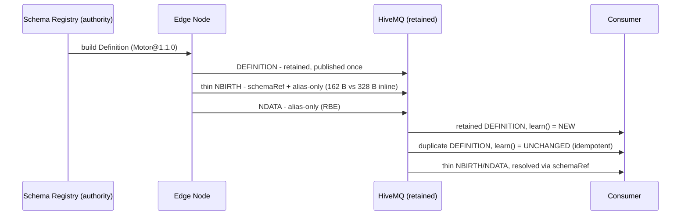

# ADR-0008 — Schema↔data separation + property/quality governance (Sparkplug 4.0 concept prototype) (English translation)

- Status: **Accepted (prototype)**
- Date: 2026-06-10
- Relations: reuses the ADR-0007 registry as the "external schema authority"; reuses the retained state-on-connect pattern from ADR-0002. Code `src/main/java/dev/krillin/sparkplug/spb40/`, demo `Spb40Demo.java`. *(Original Korean: [ADR-0008-schema-data-separation.md](ADR-0008-schema-data-separation.md))*

## Context

The Sparkplug 4.0 issue set (eclipse-sparkplug/sparkplug #599–#610, 2026-05) is converging toward OPC UA semantics, with three strands at the core: **[#608](https://github.com/eclipse-sparkplug/sparkplug/issues/608) Definition messages (schema↔data separation)**, **[#607](https://github.com/eclipse-sparkplug/sparkplug/issues/607) payload-level properties**, and **[#603](https://github.com/eclipse-sparkplug/sparkplug/issues/603) richer qualities**. This ADR explores that direction as working code.

## Honesty (important)

Sparkplug 4.0 is **unreleased** and its wire format is **not final**. This PoC implements the *concepts* using Sparkplug 3.0 primitives (Template/PropertySet) — it is not a spec implementation, and the eventual 4.0 wire format may differ. Stated in the demo banner and here.

## Decision

1. **Schema separation (#608-like).** Instead of inlining the full UDT definition into every NBIRTH, a Definition built from the registry (the source of truth, ADR-0007) is published **once, retained**, to `spBv1.0/{group}/DEFINITION/{edge}/{ref}`. Data references it via a thin `schemaRef` (e.g. `Motor@1.1.0`). Consumers learn schemas from the retained Definition on connect (same shape as the ADR-0002 state-on-connect pattern).
2. **Alias convention.** Aliases are derived deterministically from the (immutable) member order of the registry definition (`alias = i + 1`) — no alias map on the wire, both sides reconstruct it identically.
3. **Metadata (#607-like).** Member `engUnit` declared in the Definition's PropertySet.
4. **Quality (#603-like).** Thin metrics carry a `quality` property (StatusCode-ish: GOOD/STALE/BAD). The consumer flags BAD/STALE/missing quality as governance violations.
5. **BIRTH-storm reduction.** With the schema out of the birth path, reconnect/rebirth NBIRTHs get thin: measured **328 B (inline types) vs 162 B (schemaRef)** per birth in this PoC. Directly relevant to the thundering-herd problem when a broker bounce makes every node re-BIRTH at once.

### Wire-behavior findings (worth noting for #608)

- **Retained Definitions are delivered twice** to a consumer that is both subscribed live and receiving the retained copy (retained-on-subscribe + live publish in the same session). Consumer-side schema learning must therefore be **idempotent**. Our `learn()` returns `LEARNED_NEW / UNCHANGED / REDEFINED`:
  - `UNCHANGED` — same ref@version, identical content: ignore (the normal duplicate case).
  - `REDEFINED` — same ref@version, *different* content: an **immutability violation**; first definition wins and an alert is raised (a governance signal, not a silent overwrite).
- The issue text for #608 proposes a monotonically updated **Config ID** carried in every message; this prototype instead uses a **content-addressed reference** (`name@semver`). The trade-off: a Config ID detects "definition changed" cheaply but says nothing about *what* changed; a versioned ref ties redefinition-mismatch handling to an external authority and makes compatibility checking (ADR-0007) possible.

## Consequences

- Governance: schema authority (registry) + metadata contract (engUnit) + runtime quality become first-class; consumer-side resolution & validation exist as working code.
- OPC UA convergence mapping with **explicit loss boundaries**: the 3-state quality is a *projection* of the 32-bit StatusCode (and Uncertain ≠ STALE) — lossless preservation means carrying the StatusCode verbatim as a UInt32 property; engUnit/EURange map to metric PropertySets, not Template Parameters. See ADR-0010.
- Limitations (PoC): node-level only (no DBIRTH/device), full-member publishes only, no runtime drift admission, and the real Sparkplug 4.0 wire format may differ.

## Links

- Code: [`src/main/java/dev/krillin/sparkplug/spb40/`](../../src/main/java/dev/krillin/sparkplug/spb40/)
- Demo: [`src/main/java/dev/krillin/sparkplug/Spb40Demo.java`](../../src/main/java/dev/krillin/sparkplug/Spb40Demo.java)
- Prior: ADR-0007 (registry gate), ADR-0002 (late joiner)
- Referenced by: ADR-0010 (OPC UA mapping — reuses this Definition/thin codec)
