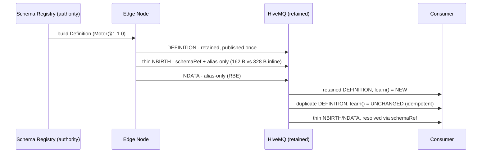

# ADR-0008 — #608 스키마-데이터 분리 + #607/#603 프로퍼티·퀄리티 거버넌스 (SpB 4.0 프로토타입)

- 상태: **Accepted (프로토타입)**
- 일자: 2026-06-10
- 관계: ADR-0007 레지스트리를 #608 "외부 스키마 권위"로 재사용. ADR-0002 retained state-on-connect 패턴 재사용. 코드 `src/.../spb40/`, 데모 `Spb40Demo.java`.

## Context
SpB 4.0(#599–#610, 2026-05)이 OPC UA 시맨틱으로 수렴 중이며 핵심 세 갈래가 **#608 Definition(스키마↔데이터 분리)**, **#607 payload properties**, **#603 qualities**다. 이는 OT 정보모델 거버넌스의 중요성을 스펙이 확인해 주는 방향. 본 ADR은 그 방향을 동작 코드로 먼저 검증한다.

## 정직성(중요)
SpB 4.0은 **미발표**(TCK 0/30, ~18mo 지연), 와이어 포맷 **미확정**. 본 PoC는 **개념 프로토타입**을 Tahu 3.0 primitive(Template/PropertySet)로 구현 — "스펙 구현" 아님. 데모 배너·이 ADR에 명시.

## Decision
1. **스키마 분리(#608).** 전체 UDT 정의를 NBIRTH에 inline하지 않고, ADR-0007 레지스트리(source of truth)에서 빌드한 Definition을 `spBv1.0/{group}/DEFINITION/{edge}/{ref}`에 **retained 1회** 발행. 데이터는 `schemaRef`(`Motor@1.1.0`)로 참조. 소비자는 connect 시 retained Definition으로 스키마 학습(ADR-0002와 동형).
2. **alias 규약.** ADR-0007 `UdtDefinition`(불변)의 멤버 순서로 `alias=i+1` 결정 — 와이어에 매핑 불필요, 양측 결정적 복원. (해석기 `learn`은 ParsedDefinition 1-인자로 ref를 자체 도출.)
3. **메타데이터(#607).** 멤버 engUnit을 Definition의 PropertySet에 선언.
4. **품질(#603).** thin 메트릭에 quality 프로퍼티(StatusCode-ish). 소비자가 BAD/STALE/누락을 거버넌스 위반으로 플래그.
5. **BIRTH-storm 절감.** 스키마가 birth 경로 밖 → 재접속/rebirth NBIRTH가 얇아짐(실측 fat=328B vs thin=162B, 166B/birth 절감). 브로커 bounce 시 전 노드 동시 재BIRTH(thundering herd) 부하 완화와 직결.

## Consequences
- 거버넌스: 스키마 권위(레지스트리) + 메타데이터 계약(engUnit) + 런타임 품질(quality)이 1급 시민. 소비자측 해석·검증이 동작 코드.
- OPC UA 수렴 매핑(**손실 경계 명시**: quality 3-state는 32비트 StatusCode의 *투영*이며 Uncertain≠STALE — 무손실은 StatusCode를 UInt32 property로 보존; engUnit/EURange는 metric PropertySet이지 Template Parameter 아님) → ADR-0010.
- 한계(PoC): node-level만(DBIRTH/device 제외), 전체 멤버 발행만(부분 발행 제외), 런타임 드리프트 admission 제외, SpB 4.0 실제 와이어와 다를 수 있음.

## Links
- 코드: `../../src/main/java/dev/krillin/sparkplug/spb40/`
- 데모: `../../src/main/java/dev/krillin/sparkplug/Spb40Demo.java`
- 선행: ADR-0007(레지스트리), ADR-0002(late-joiner)
