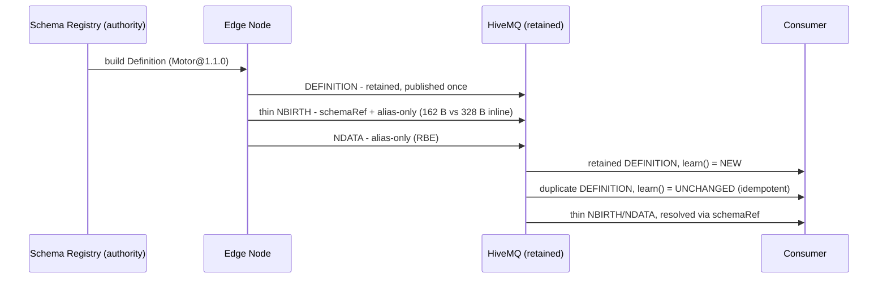

# ADR-0008 — 스키마와 데이터의 분리(#608) 및 메타데이터·품질 거버넌스(#607/#603) (Sparkplug 4.0 프로토타입)

- 상태: **Accepted (개념 검증 프로토타입)**
- 일자: 2026-06-10
- 관계: ADR-0007 레지스트리를 외부 스키마 권위(#608)로 연계. ADR-0002 Retained 상태 증명 패턴 적용. 소스 코드: `src/.../spb40/`, 데모: `Spb40Demo.java`.

## 1. 배경 및 맥락 (Context)
Sparkplug 4.0 표준화 논의(Issue #599–#610)는 OPC UA 의미론과의 정렬을 지향하고 있으며, 핵심 축은 세 가지입니다:
1. **#608 Definition (스키마와 데이터의 분리)**
2. **#607 Payload Properties (엔지니어링 단위 등 메타데이터 선언)**
3. **#603 Qualities (메트릭별 데이터 품질 명시)**

이는 산업 OT 정보 모델 거버넌스의 필요성이 표준 사양 레벨에서 공인되는 흐름입니다. 본 ADR은 이러한 차세대 표준 개념을 동작 코드로 사전 실증하는 것을 목적으로 합니다.

## 2. 프로토타입 범위 및 제약 명시
Sparkplug 4.0은 표준화 진행 중인 규격으로 최종 와이어 포맷이 확정되지 않았습니다. 본 구현은 Sparkplug 3.0의 기본 프리미티브(Template 및 PropertySet)를 조합하여 차세대 개념을 모사한 **개념 검증 프로토타입(PoC)** 이며, 정식 사양 구현체가 아님을 명시합니다.

## 3. 아키텍처 결정 (Decision)
1. **스키마 분리 및 Retained 단일 발행 (#608)**:
   - 대규모 UDT 정의를 매 NBIRTH마다 전체 인라인으로 전송하지 않고, 중앙 레지스트리(ADR-0007) 기반의 정의(Definition)를 `spBv1.0/{group}/DEFINITION/{edge}/{ref}` 토픽에 **Retained 1회** 발행합니다.
   - 데이터 페이로드는 얇은 스키마 참조(`schemaRef`, 예: `Motor@1.1.0`)만을 탑재합니다. 소비자는 접속 시 Retained Definition을 1회 학습(Learn)하여 스키마를 구성합니다.
2. **결정론적 메트릭 별칭(Alias) 부여 규칙**:
   - ADR-0007 `UdtDefinition`의 불변 멤버 순서에 따라 `alias = i + 1`을 결정론적으로 도출하므로, 와이어상에 별칭 매핑 테이블을 중복 전송할 필요가 없습니다.
3. **메타데이터 계약 선언 (#607)**:
   - 멤버 엔지니어링 단위(`engUnit`)를 Definition의 PropertySet에 공식 선언합니다.
4. **품질 상태 코드 투영 (#603)**:
   - 메트릭에 품질 프로퍼티(StatusCode)를 부여하여, 소비자가 BAD/STALE/누락 상태를 감지하고 거버넌스 위반으로 격리할 수 있도록 지원합니다.
5. **Birth 메시지 폭풍(Thundering Herd) 완화**:
   - 스키마가 분리됨에 따라 브로커 재기동 시 발생하는 NBIRTH 대역폭이 대폭 절감됩니다 (실측: 인라인 328 B vs 경량화 162 B, 회당 166 B 절감).

## 4. 결과 및 영향 (Consequences)
- **정보 모델 거버넌스 정립**: 스키마 권위(레지스트리), 메타데이터 계약(`engUnit`), 런타임 품질 플래그(`quality`)가 일관된 데이터 파이프라인 요소로 편입됩니다.
- **OPC UA 매핑 시 손실 한계 명시**: Sparkplug의 3단계 품질 상태는 32비트 OPC UA StatusCode의 압축 투영이므로, 무손실 데이터 전송이 필요한 경우 부가 채널(ADR-0010)을 통해 원시 UInt32 상태를 병행 유지합니다.
- **한계점 (PoC 범위)**: 노드 레벨 UDT를 대상으로 실증하였으며, 동적 런타임 스키마 진화 승인 엔진은 후속 과제로 위임합니다.

## 5. 관련 자산 및 링크
- 소스 코드: `src/main/java/dev/krillin/sparkplug/spb40/`
- 라이브 데모: `src/main/java/dev/krillin/sparkplug/Spb40Demo.java`
- 연계 ADR: ADR-0002 (접속 시점 상태 복원), ADR-0007 (스키마 레지스트리 게이트), ADR-0010 (OPC UA to UDT 사상)
