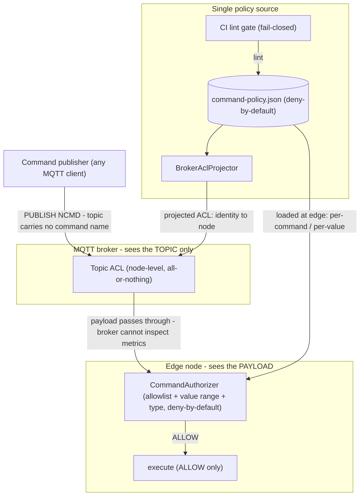

# ADR-0011 — NCMD 제어 명령 인가 및 계층형 정책 코드화(Policy-as-Code)

- 상태: **Accepted**
- 일자: 2026-06-11
- 관계: NCMD 명령 권한 매트릭스를 동작 코드로 강제. 스키마 게이트(ADR-0007)의 폐쇄형 실패(Fail-Closed) CLI 패턴 재사용. Edge Node ID 유일성(ADR-0006) 기반의 신원 책임 분담. 소스 코드: `src/.../acl/`, 데모: `CommandAclDemo.java`. (참고: `acl/` 및 런타임 브리지 코드는 이후 [bifrost](https://github.com/yggdrasil-iiot/bifrost)의 Heimdall 데몬으로 정식 이관됨)

## 1. 배경 및 맥락 (Context)
Sparkplug B 표준 사양에서 NCMD(Node Command) 토픽은 기본적으로 인가 통제가 내장되어 있지 않습니다. 임의의 MQTT 클라이언트가 `spBv1.0/{group}/NCMD/{edge}` 토픽으로 메시지를 발행할 경우, 엣지 노드의 메시지 핸들러가 검증 없이 이를 물리 제어기에 전달할 위험이 있습니다. 

이를 OT 쓰기 복귀(Writeback, 설정값 변경 등)로 확장할 경우 임의의 주체가 설비에 유효하지 않은 제어 명령을 주입할 수 있으므로, 엄격한 명령 실행 권한 인가 체계가 필수적입니다.

## 2. 핵심 아키텍처 제약 및 통찰 (Key Architectural Insight)
Sparkplug NCMD 토픽 경로(`spBv1.0/{group}/NCMD/{edge}`)에는 **개별 제어 명령의 이름이 포함되지 않습니다.** 재기동(Reboot), 상태 재보고(Rebirth), 설정값 변경(Setpoint) 등의 모든 명령이 단일 NCMD 토픽을 공유하며, 구체적인 명령의 식별자는 페이로드 내부 메트릭(Metric)에 위치합니다.

따라서 다음과 같은 구조적 귀결이 도출됩니다:
- **브로커 토픽 ACL의 한계**: MQTT 브로커 레벨의 토픽 ACL은 페이로드 내부를 검사할 수 없으므로, 특정 클라이언트가 특정 노드에 도달할 수 있는지 여부(노드 레벨 All-or-Nothing)만 제어 가능합니다.
- **엣지 인가의 필수성**: 명령별(Per-command), 파라미터 값 범위별(Per-value) 세부 인가는 페이로드를 역직렬화하여 메트릭을 직접 검사하는 엣지 노드에서만 집행 가능합니다.

## 3. 아키텍처 결정 (Decision)
단일 정책 원천(`registry/command-policy.json`, 기본 거부)을 기반으로 두 개의 강제 지점과 한 개의 CI 게이트로 다층 투영합니다:

1. **엣지 계층 (페이로드 심층 인가)**:
   - 순수 함수형 엔진인 `CommandAuthorizer`가 명령 실행 전 정책을 대조합니다.
   - 명령 화이트리스트, 파라미터 허용 수치 범위(최소/최대 경계), 데이터 타입, 대상 장치 일치 여부를 검사하며, 최초 일치(First-match) 및 **기본 거부(Deny-by-Default / Fail-Closed)** 원칙을 집행합니다.
   - `GuardedEdgeNode`가 NCMD 핸들러에서 명시적 ALLOW 판정을 받은 명령만을 실제 설비 드라이버로 전달합니다.
2. **브로커 계층 (신원 기반 노드 도달성 제어)**:
   - `BrokerAclProjector`가 중앙 정책을 브로커 고유의 ACL 표현(주체 신원 → NCMD 토픽 발행 권한)으로 변환 산출합니다 (대상 와일드카드 `*`는 MQTT `+`로 투영).
3. **CI 게이트 계층 (사전 검증)**:
   - `CommandPolicyGate` CLI가 정책 파일의 문법적 무결성 및 최소 권한 원칙(기본 거부 누락, ID 중복, 유효하지 않은 제약 조건, 과도한 와일드카드 사용 등)을 린트(Lint) 검사하여, 결함이 있는 정책의 배포를 차단합니다.

## 4. 확장 아키텍처: OPA/Rego 기반 인프로세스 WebAssembly 인가
고도화된 컨텍스트 조건(예: 특정 작업 조/시간대에만 허용, 특정 설비 운전 상태에서만 허용)을 지원하기 위해 정책 판단 엔진을 규칙 기반 엔진으로 확장하였습니다:
- **Rego 정책 외부화**: 시간대(`context.hour`) 및 설비 상태(`context.state`)를 입력받아 동적 인가를 수행합니다.
- **JVM 내장 WASM 평가**: Rego 정책을 WebAssembly로 컴파일하고, Chicory 런타임을 통해 별도의 외부 OPA 서버나 네트워크 호출 없이 JVM 프로세스 내부에서 인프로세스 평가를 완료합니다 (밀리초 미만 지연시간 달성).

## 5. 결과 및 영향 (Consequences)
- **심층 방어(Defense-in-Depth) 체계 확립**: 브로커의 네트워크 도달성 통제와 엣지의 파라미터 범위 검증이 상호보완적으로 결합되어 오작동 및 비인가 제어를 방지합니다.
- **구현 제약 사항**: 본 PoC에서 브로커 ACL은 산출물 프로젝션 및 정적 검증에 집중하며, 명령 감사 로그는 구조화된 콘솔 로그 형태로 출력됩니다 (영속 분산 원장은 Bifrost 계층으로 발전).

## 6. 관련 자산 및 링크
- 소스 코드: `src/main/java/dev/krillin/sparkplug/acl/`
- 데모 애플리케이션: `src/main/java/dev/krillin/sparkplug/CommandAclDemo.java`
- 정책 파일: `registry/command-policy.json`
- 연계 문서: ADR-0006 (식별자 유일성), ADR-0007 (스키마 게이트), `namespace-standard.md` §7
