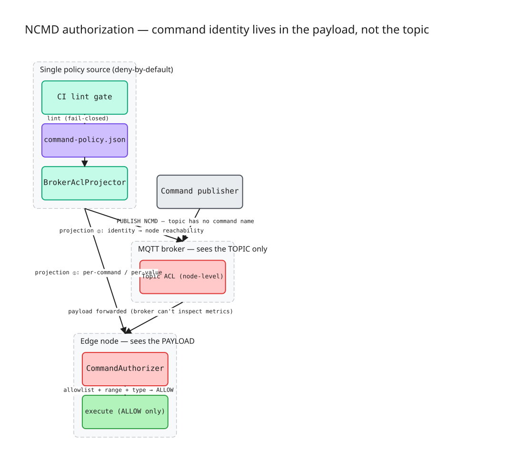

# ADR-0011 — NCMD 명령 인가 / 계층형 policy-as-code

- 상태: **Accepted**
- 일자: 2026-06-11
- 관계: NCMD 명령권한 매트릭스를 동작 코드로 강제. 스키마 게이트(ADR-0007)의 fail-closed CLI 패턴 재사용. edge-id 유일성(ADR-0006)과 신원 책임 분담. 코드: `src/.../acl/`, 데모 `CommandAclDemo.java`.

## Context
현재 NCMD는 **완전 무방비**다. `RebirthCmd`/`HostApp`/`LateJoinerExperiment`가 자유롭게 `spBv1.0/{group}/NCMD/{edge}`에 발행하고, `EdgeNode.messageArrived`는 수신 명령을 **인가 없이 그대로 실행**한다. OT writeback(setpoint 등)으로 확장하면 "누구나 임의 값을 장비에 쓸 수 있음" = 안전·거버넌스 공백 — "누가 밸브를 여는가"라는 명령 권한 문제가 비어 있다.

## Decision
**날카로운 통찰:** Sparkplug NCMD 토픽 `spBv1.0/{group}/NCMD/{edge}`에는 **명령 이름이 없다.** Rebirth·Reboot·Setpoint가 전부 동일 토픽이고 명령 정체성은 payload 안의 metric이다. 귀결 — 브로커 토픽 ACL은 per-command 인가가 **구조적으로 불가능**(노드 단위 all-or-nothing까지만); per-command·per-value 인가는 payload를 보는 edge에서만 가능하다. 두 강제 층은 서로의 일을 대신할 수 없다.

따라서 **단일 정책 소스**(`registry/command-policy.json`, deny-by-default)를 두 강제 지점 + 한 CI 게이트에 투영한다:

1. **edge 층 = payload→명령·값.** `CommandAuthorizer`(순수)가 수신 명령을 실행 *전* 정책 대조 — 명령 allowlist + 값 범위(min/max 포함 경계) + 타입 + 타깃 일치, **first-match, deny-by-default(fail-closed)**. `GuardedEdgeNode`(EdgeNode 형제, 무수정)가 NCMD 핸들러에서 ALLOW만 실행.
2. **브로커 층 = 신원→노드 도달성.** `BrokerAclProjector`(순수)가 정책 → 브로커 ACL 표현(principal→NCMD 토픽 PUBLISH) 포터블 아티팩트 산출. target의 `*`는 MQTT 단일레벨 와일드카드 `+`로 렌더. *라이브 강제 아님 — 아티팩트.*
3. **CI 게이트.** `CommandPolicyGate`(SchemaGate 형제 CLI)가 정책 well-formedness + 최소권한 린트(default≠deny / id 중복 / 무의미 constraint / `*` 과대권한 / 미지 필드)를 검사, 위반 시 non-zero exit로 shift-left 차단. **fail-closed**(파싱/IO 오류 → exit 2, 통과시키지 않음).

## Consequences
- 명령 인가가 프로토콜 밖에서 *실제로* 강제됨 — 정책 1소스가 edge 런타임·브로커 설정·CI 세 지점에 일관 투영. 데모에서 브로커 ACL이 못 막는 값-범위 위반(`Rpm=99999`)을 edge가 차단해 통찰을 라이브 증명.
- **한계·정직성(PoC):** 브로커 ACL은 **투영·검증만**(라이브 HiveMQ RBAC 미가동 — 실제 강제는 브로커 설정 책임). 발행자 **신원=브로커/MQTT auth 책임**, edge는 principal-독립(재인증·암호 서명 없음 — 서명은 프로덕션 하드닝). 감사는 콘솔/구조화 로그까지(영속 감사스토어 ❌). 단일 정책 파일·PoC 스케일. `oneOf` 이산 허용값 집합은 v1 비범위(numeric min/max로 충분).
- ADR-0007(스키마 게이트)와 같은 policy-as-code + fail-closed CLI 패턴 — 데이터계약 거버넌스와 명령 거버넌스가 동형. ADR-0006(edge-id 유일성)이 보장하는 안정적 노드 정체성 위에 명령 권한 매트릭스를 얹는다.

## Links
- 코드: `../../src/main/java/dev/krillin/sparkplug/acl/`
- 셸: `../../src/main/java/dev/krillin/sparkplug/GuardedEdgeNode.java`
- 데모: `../../src/main/java/dev/krillin/sparkplug/CommandAclDemo.java`
- 정책: `../../registry/command-policy.json`
- 관계: ADR-0007(스키마 게이트), ADR-0006(edge-id 유일성), `namespace-standard.md` §7
